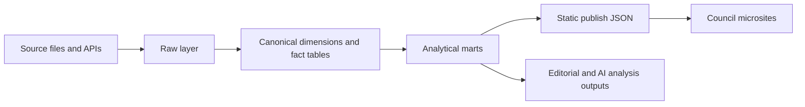

# Council platform model

This document turns the Lancashire / AI DOGE implementation into a reusable data platform design.

## Objective

Build one platform that can power:

- council transparency products like AI DOGE
- specialist verticals like asylumstats
- future local accountability sites without rebuilding the core pipeline each time

## Platform principles

- Static-first publishing
- Canonical ids across bodies and people
- Clear separation between raw, canonical, marts, and publish layers
- Derived outputs treated as auditable datasets
- Cross-council comparison designed in from day one

## Architecture

## Core dimensions

### `dim_body`

- `body_id`
- `body_name`
- `body_short_name`
- `body_type`
- `body_tier`
- `country_code`
- `region_name`
- `official_code`
- `website_url`
- `is_active`

### `dim_period`

- `period_id`
- `period_start`
- `period_end`
- `period_type`
- `financial_year`
- `calendar_year`
- `quarter`
- `month`

### `dim_source`

- `source_id`
- `source_name`
- `publisher`
- `source_family`
- `access_method`
- `license`
- `primary_url`
- `api_or_download`
- `cadence`

### `dim_supplier`

- `supplier_id`
- `supplier_name_canonical`
- `supplier_name_raw`
- `company_number`
- `charity_number`
- `supplier_type`
- `postcode`
- `country`

### `dim_councillor`

- `councillor_id`
- `body_id`
- `display_name`
- `full_name`
- `party`
- `ward_name`
- `moderngov_uid`
- `email`
- `term_start`
- `term_end`

## Core facts

### `fact_spending_transaction`

Grain:

- one payment line or published spend line

Key fields:

- `transaction_id`
- `body_id`
- `source_id`
- `period_id`
- `supplier_id`
- `supplier_name_raw`
- `transaction_date`
- `amount_gbp`
- `department_raw`
- `service_area_raw`
- `reference`
- `spend_type`
- `currency`

### `fact_budget_outturn`

Grain:

- one body x financial year x service/category

Key fields:

- `budget_record_id`
- `body_id`
- `source_id`
- `financial_year`
- `service_name`
- `budget_family`
- `net_budget_gbp`
- `gross_expenditure_gbp`
- `income_gbp`
- `reserves_gbp`
- `council_tax_requirement_gbp`

### `fact_budget_mapping`

Grain:

- one raw department or service label mapped to one normalized finance category for a validity period

Key fields:

- `mapping_id`
- `body_id`
- `source_label`
- `mapped_budget_category`
- `confidence`
- `mapping_method`
- `review_status`
- `valid_from`
- `valid_to`
- `mapped_spend_gbp`

### `fact_procurement_notice`

Grain:

- one opportunity or award notice

Key fields:

- `notice_id`
- `body_id`
- `source_id`
- `notice_type`
- `status`
- `title`
- `published_date`
- `deadline_date`
- `awarded_date`
- `value_low_gbp`
- `value_high_gbp`
- `awarded_value_gbp`
- `awarded_supplier`
- `cpv_codes`
- `source_notice_url`

### `fact_meeting`

Grain:

- one meeting

Key fields:

- `meeting_id`
- `body_id`
- `committee_id`
- `meeting_date`
- `meeting_time`
- `venue`
- `status`
- `agenda_items`
- `documents`
- `minutes_url`

### `fact_vote_event`

Grain:

- one recorded vote item

Key fields:

- `vote_event_id`
- `body_id`
- `meeting_id`
- `meeting_date`
- `title`
- `policy_areas`
- `outcome`
- `for_count`
- `against_count`
- `abstain_count`
- `absent_count`

### `fact_vote_record`

Grain:

- one councillor x vote event

Key fields:

- `vote_record_id`
- `vote_event_id`
- `councillor_id`
- `vote`

### `fact_election_result`

Grain:

- one candidate x ballot or one party x ward summary depending table family

### `fact_integrity_profile`

Grain:

- one councillor x generation run

Key fields:

- `integrity_profile_id`
- `councillor_id`
- `body_id`
- `generated_at`
- `risk_level`
- `integrity_score`
- `total_flags`
- `critical_flags`
- `high_flags`
- `supplier_conflicts`
- `undeclared_interests`
- `network_investigations_advisable`

### `fact_supplier_profile`

Grain:

- one supplier x generation run

Key fields:

- `supplier_profile_id`
- `supplier_id`
- `generated_at`
- `total_spend_gbp`
- `transaction_count`
- `bodies_count`
- `risk_level`
- `integrity_score`

## Data products to expose publicly

### Body-level pages

- body summary
- spending explorer
- budget explorer
- procurement page
- meetings and votes page
- councillor and integrity page

### Cross-body pages

- supplier profiles
- budget comparison
- procurement comparison
- integrity comparison

### Vertical products

Use the same platform to support specialist products such as asylumstats by adding domain marts rather than rebuilding the base stack.

## Storage layers

### `raw/`

Keep:

- downloaded source files
- scrape captures
- API responses
- checksums
- fetch metadata

### `canonical/`

Keep:

- normalized parquet or duckdb tables
- stable ids
- cleaned dates and numbers
- source provenance

### `marts/`

Keep:

- UI-optimized datasets
- cross-council summaries
- editorial inputs
- search indexes

### `publish/`

Keep:

- final static JSON
- compressed delivery artifacts
- sitemap/feed outputs

## Why this is better than the current repo shape

- Raw and derived data stop being mixed together.
- Cross-council comparison becomes easier.
- New councils become onboarding work, not redesign work.
- Specialist products like asylumstats can consume shared body, source, geography, supplier, and procurement layers.
